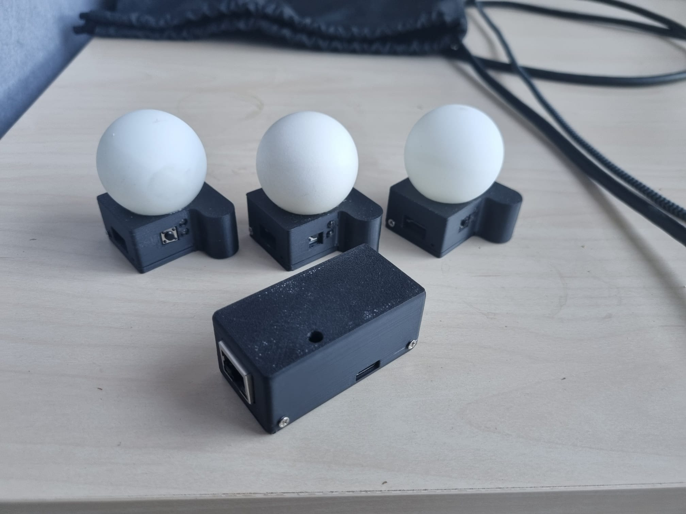
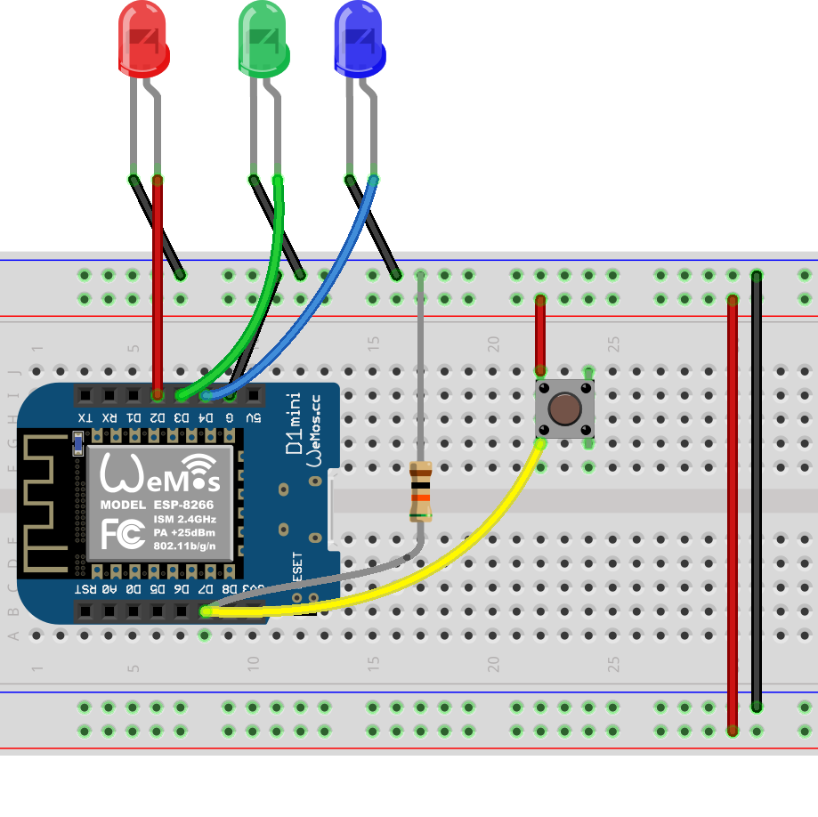
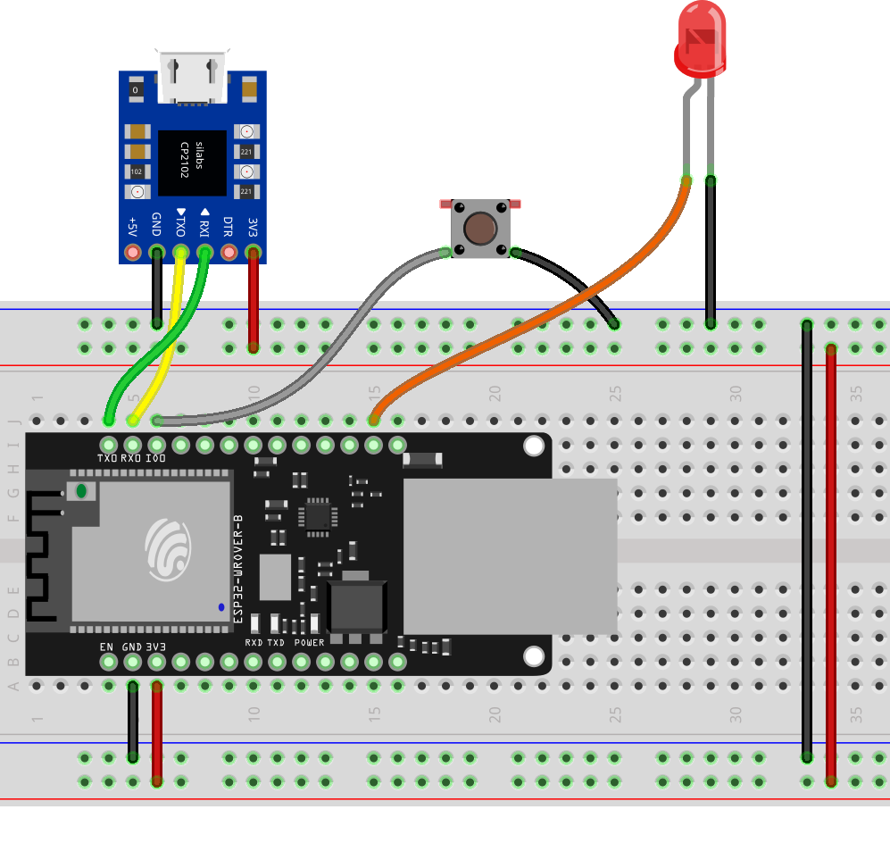
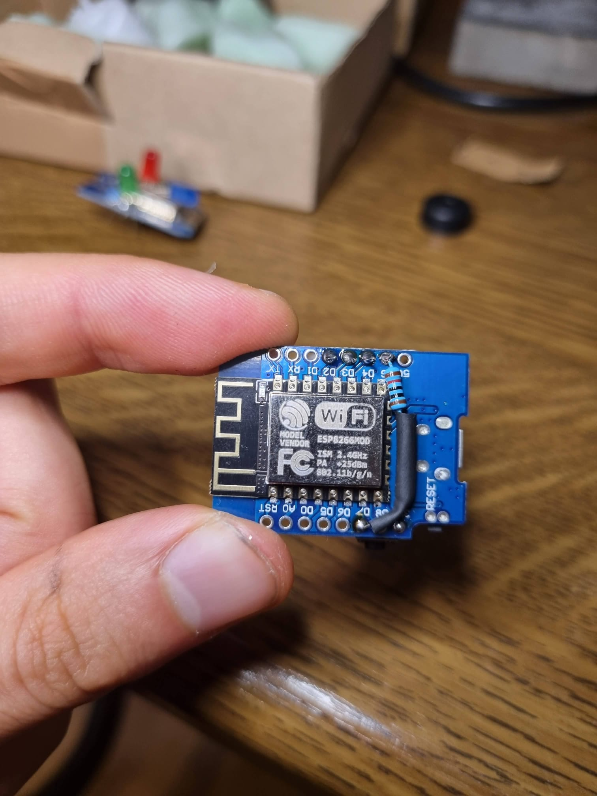
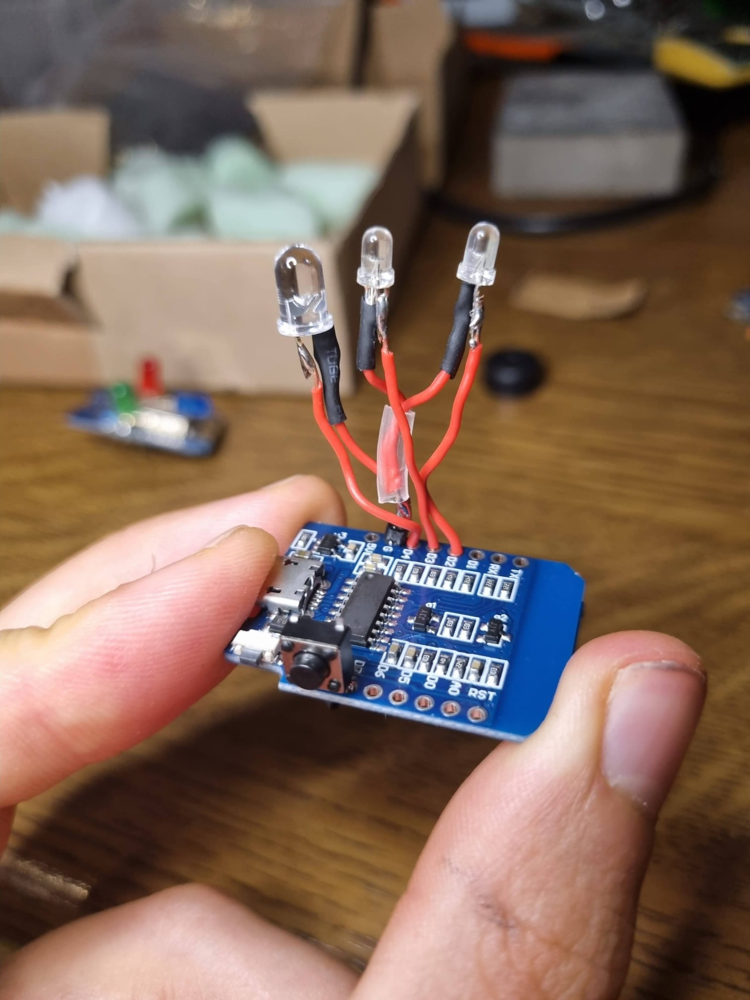
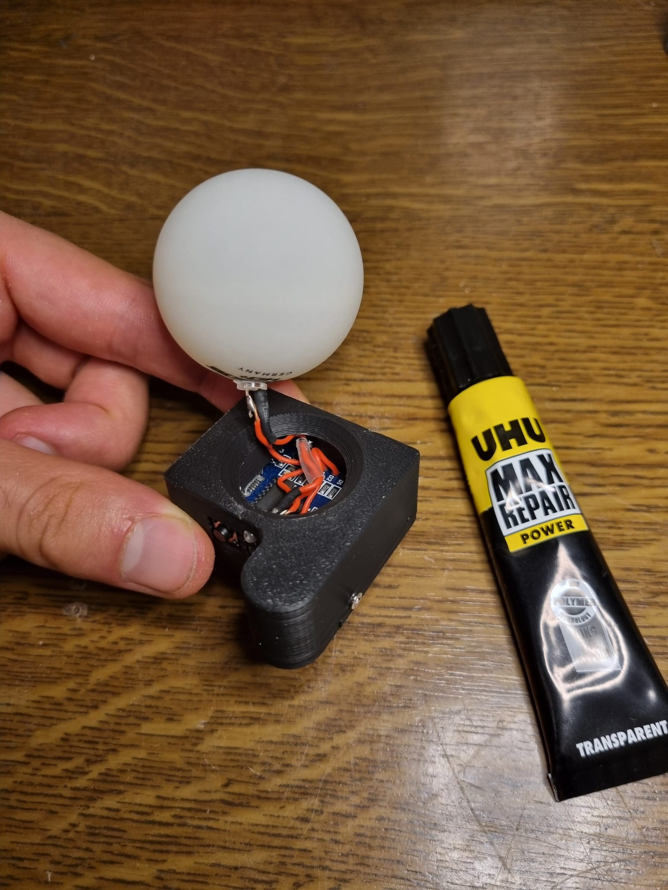

# Tally System for ATEM Switcher using ESP-Now

Commercial tally systems that signal whether a camera is currently live or in preview are quite expensive. This project enables you to create such a system for a fraction of the cost.

We use a WT32-ETH01 module as a Controller and ESP8266 Mini D1 modules as Clients. The Controller is connected via LAN and grabs the ATEM updates from the network. Updates are then sent to the client over ESP-Now which is a low-power wireless network protocol by espressif.

    

## Hardware
### Bill of Materials
| Component | Quantity | Link |
|-----------------------|---------------------|---------------------|
| WT32-ETH01 | 1 | [Ebay](https://www.ebay.com/sch/i.html?_nkw=WT32-ETH01); [AliExpress](https://aliexpress.com/w/wholesale-WT32%2525252dETH01.html) |
| ESP8266 Mini D1 | 1+ | [Ebay](https://www.ebay.com/sch/i.html?_nkw=ESP8266%20Mini%20D1); [AliExpress](https://aliexpress.com/w/wholesale-ESP8266%20Mini%20D1.html) |
| LEDs (5mm red, 3mm green and blue) | 3 per Receiver | [Ebay](https://www.ebay.com/sch/i.html?_nkw=LED%20sortiment); [AliExpress](https://de.aliexpress.com/w/wholesale-LED-sortiment.html) |
| 10k Ohm resistor | 1 per Receiver | [Ebay](https://www.ebay.com/sch/i.html?_nkw=10k%20resistor); [AliExpress](https://aliexpress.com/w/wholesale-10k-resistor.html) |
| Button | 1 per Receiver/Controller | [Ebay](https://www.ebay.com/sch/i.html?_nkw=momentary%20switch%206x6mm); [AliExpress](https://aliexpress.com/w/wholesale-momentary-switch-6x6mm.html) |
| xxx mm screws | x per Receiver/Controller | [Ebay](); [AliExpress]() |

### 3D Printed Case
TODO: Add files

You can find the STL files in the ``./XXXX`` folder.

#### Print Settings
| Setting | Value |
|-----------------------|---------------------|
| Layer Height | xxxmm |
| Infill | xx% |
| Supports | ? |

### Wiring
All you need to do is solder the three LEDs and the button to the ESP8266 Mini D1. The GPIO of the button is pulled down using a 10k Ohm resistor. The red LED is used for the program and is placed inside a ping pong ball. Just use a drill to make a fitting hole. The green LED is used for the preview and the blue LED is a status LED.

For the Controller you just need to solder on an LED to the WT32-ETH01 module if you want to have a status LED. The WT32-ETH01 module does not have an integrated USB to serial converter so you need to add one. You can use any USB to serial converter that has 3.3V logic levels. To enter flash mode you need to connect the GPIO0 pin to GND while powering on the module. You can then release the GPIO0 pin and upload the code. For easier flashing you can also add a button to the GPIO0 pin and GND.

| Receiver Pinout | Controller Pinout |
|-----------------------|---------------------|
|  |  |

| Pulldown Button to GND | Connect three LEDs| Fit into case and glue ball to case|
|-----------------------|---------------------|---------------------|
|  |  |  |

## Code
The code is written for [platformio](https://platformio.org/). The easiest way is to use VS Code and install the platformio extension. Then you can simply open the project folder and compile and upload the code to the devices. The Receiver can be flashed by connecting the ESP8266 Mini D1 to your computer via USB. For the Controller you need to use the connected usb to serial converter as described above. Remember also to enter flash mode by connecting GPIO0 to GND while powering on the module.

## Configuration
The Controller can be connected to your network via LAN. It will automatically acquire an IP address via DHCP. You can either reach the control interface via the IP address or by using the DNS name [WT32-ETH01.local](http://WT32-ETH01.local). On the control interface, you can configure the IP addresses of the ATEM switcher. If the Controller is successfully connected to the ATEM switcher the red LED will turn off.

The Receivers need to be configured with the IP address of the Controller. You can do this by pressing the button on the Client while you plug in the power cable and wait until the blue LED stops blinking. You can then release the button and connect to the Wifi of the Client. A website should open where you can change the ID of the client.

 The brightness of the LEDs is controlled using PWM. You can configure this in the code by changing the parameters in ``./Receiver/include/leds.h``.

## Used libraries
Many thanks to the authors of the following libraries:
- [ESPAsyncWebServer](https://github.com/khoih-prog/WebServer_WT32_ETH01)
- [ATEMbase, ATEMstd, SkaarhojPgmspace](https://github.com/kasperskaarhoj/SKAARHOJ-Open-Engineering/tree/master) (adjusted to work with ESP32-ETH01)